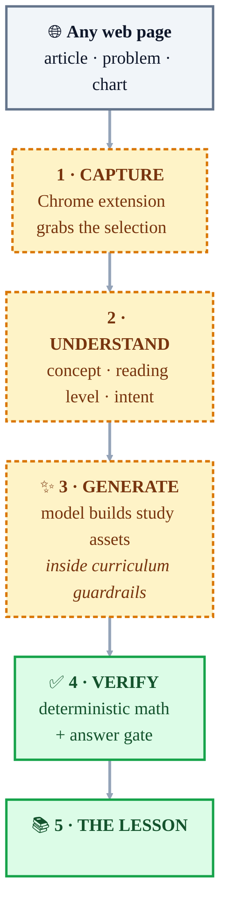
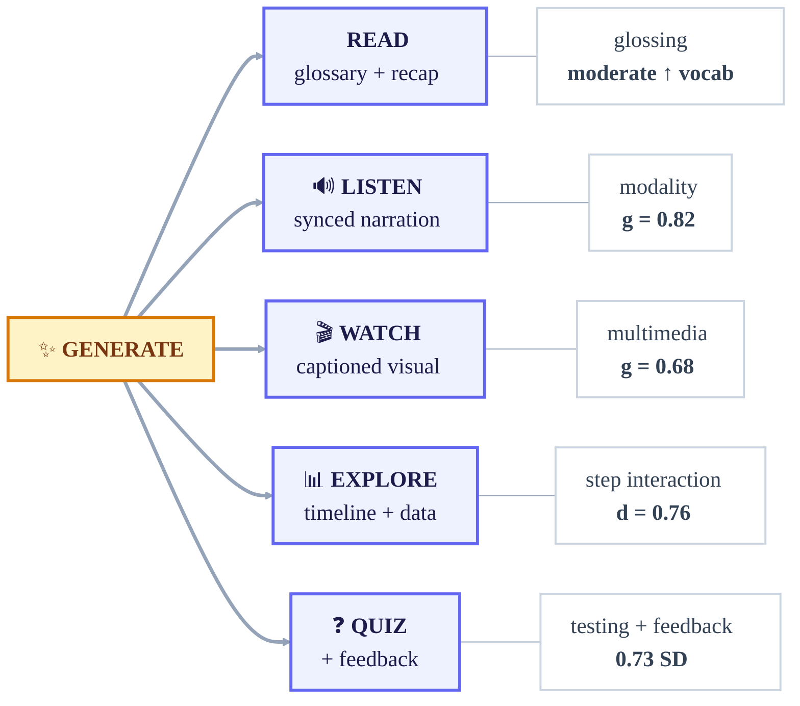
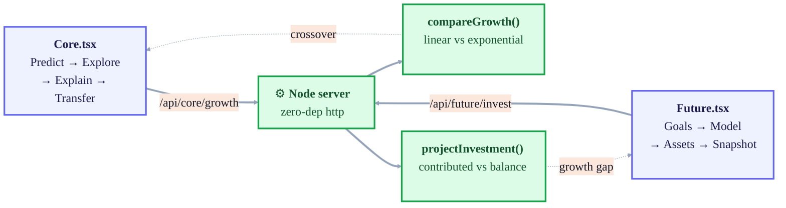

# Prism

**One concept. As many ways as it takes to make it click.**

Prism is an adaptive learning copilot with two focused experiences:

- **Prism Core** teaches linear versus exponential growth through prediction, synchronized graphs and tables, diagnostics, transparent mode recommendations, and a transfer challenge.
- **Prism Future** connects investing concepts to 3–5 user-selected life goals through deterministic projections, time and fee comparisons, asset tradeoffs, and an aspirational Future Snapshot prompt.

The hackathon build is educational software, not an answer bot, brokerage calculator, or personalized investment adviser.

## Architecture

A learner highlights anything on the web. Prism turns it into a lesson that
teaches the same idea through **several senses at once** — because that is what
the evidence supports (see [Research basis](docs/prism/RESEARCH_BASIS.md)).

### The pipeline



🟩 **built** · 🟨 **to build** — the generation pipeline (steps 1–3) is the
hackathon's main work; the verifiers and lesson UI already exist.

### What step 3 generates — and why each asset earns its place



> **The rule that keeps us honest:** the model writes *content*; it never does
> *math*. Every number a learner sees comes from a deterministic verifier
> (`packages/verifiers`), and the answer stays gated until a real attempt is
> made. The model also never picks a modality "to match a learning style" —
> every learner gets every modality. See
> [Research basis](docs/prism/RESEARCH_BASIS.md).

### Today's runtime (what already ships)



> **The full circle:** Core's linear path (`+increment`) and Future's "you
> contribute" line are the *same shape*. Core's exponential path (`×multiplier`)
> and Future's compounding "balance" are the *same shape*. **Core's crossover is
> Future's growth.** One engine, two audiences.

| Location | Responsibility |
|---|---|
| `apps/web` | Responsive learning UI and server routes |
| `apps/extension` | Minimal-permission MV3 side panel and selection capture |
| `packages/shared` | Authoritative contracts and provider interfaces |
| `packages/verifiers` | Deterministic growth, investing, and algebra logic |
| `packages/learning-engine` | Answer gate, hints, adaptations, and quizzes |
| `packages/curriculum` | Approved concept objects |
| `packages/api-client` | Typed client boundary |

**Pedagogy is evidence-based.** Design choices are grounded in peer-reviewed
learning science — see [`docs/prism/RESEARCH_BASIS.md`](docs/prism/RESEARCH_BASIS.md)
for the feature→evidence map, effect sizes, and the claims we deliberately avoid
(notably the debunked "learning styles" myth). Cite from there when authoring
curriculum or pitch copy.

## Run locally

Requirements: Node.js 22+ and npm 10+.

```bash
npm install
npm run build
npm run dev
```

Open [http://localhost:8787](http://localhost:8787). The server binds to `0.0.0.0` by default for same-hotspot demos; set `HOST=127.0.0.1` to keep it local.

For UI development with hot reload, keep the API server running and start Vite in another terminal:

```bash
npm run dev
npm run dev:ui -w prism-web
```

The production build compiles the React UI into `apps/web/public`, where the dependency-free Node server serves it.

## Load the Chrome extension

1. Open `chrome://extensions`.
2. Enable **Developer mode**.
3. Select **Load unpacked** and choose `apps/extension`.
4. Highlight ordinary webpage text and choose **Learn this with Prism** from the context menu.
5. Confirm the selection and choose a learning goal in the side panel.

The extension requests only `sidePanel`, `storage`, `contextMenus`, and temporary `activeTab` access. It does not request browsing history or broad host access, monitor pages, or read other tabs.

## Quality commands

```bash
npm run lint       # TypeScript static checks
npm run typecheck
npm test
npm run build
```

## Demo path

### Prism Core

1. Predict which growth model wins.
2. Explore the synchronized graph, controls, and value table.
3. Miss the diagnostic twice to trigger an explained table-mode recommendation.
4. Complete the new-context transfer challenge.

### Prism Future

1. Choose 3–5 future goals or add a custom goal.
2. Adjust manual contribution, horizon, return, and fee assumptions.
3. Compare starting five years later and paying a higher fee.
4. Review ETFs, individual stocks, and bonds.
5. Use the local Future Snapshot illustration or opt into image generation with a user-provided key.

## Privacy and safety

- Selected page content is treated as untrusted and shown before use.
- Original homework answers remain server-gated until a meaningful attempt.
- Financial data is manual and remains in memory for this demo.
- No bank credentials, provider tokens, or model secrets are shipped to the extension.
- Projections are illustrative, inflation-aware scenarios—not guarantees.
- Future Snapshot image generation is opt-in and browser-to-provider. A user-provided OpenAI API key is stored only in that browser's `localStorage`, never sent to Prism's server, logged, or committed. Without a key, Prism shows a local illustration.

## Known limitations

- In-memory sessions and plans reset with the server.
- The extension hands the confirmed goal to the web experience but the full session UI runs in the web app.
- Volatility, taxes, employer matches, and individualized suitability are intentionally excluded.
- The algebra verifier supports a constrained linear-expression grammar.
- Browser-side image generation depends on provider CORS, account access, billing, rate limits, and content policy; the local illustration remains available when it fails.

See [PRISM_HACKATHON_BUILD_SPEC.md](PRISM_HACKATHON_BUILD_SPEC.md), [AGENTS.md](AGENTS.md), and [CODEX_HANDOFF.md](CODEX_HANDOFF.md) for implementation details and next steps.
