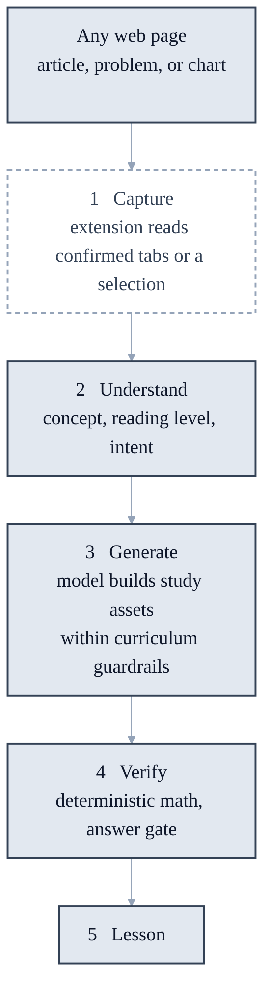
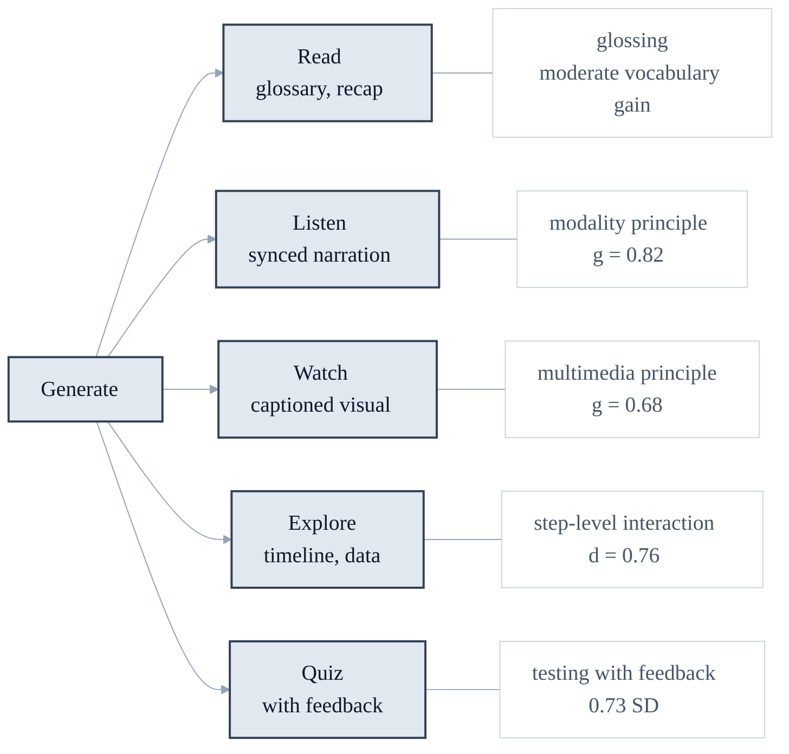
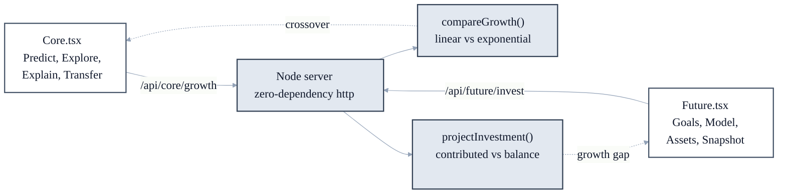

# Prism

**One concept. As many ways as it takes to make it click.**

Prism is an adaptive learning copilot with two focused experiences:

- **Prism Core** teaches linear versus exponential growth through prediction, synchronized graphs and tables, diagnostics, transparent mode recommendations, and a transfer challenge.
- **Prism Future** connects investing concepts to 3–5 user-selected life goals through deterministic projections, time and fee comparisons, asset tradeoffs, and an aspirational Future Snapshot prompt.

The hackathon build is educational software, not an answer bot, brokerage calculator, or personalized investment adviser.

## Architecture

A learner highlights anything on the web. Prism turns that selection into a
lesson that teaches the same idea through several modalities at once, a design
grounded in peer-reviewed learning science
(see [Research basis](docs/prism/RESEARCH_BASIS.md)).

### Pipeline



Capture, persistence, structured generation, validation, and the lesson library
now run end to end. The learner explicitly chooses which tabs or selection to
share before Prism reads page text.

### Generated assets and their evidence



Two constraints hold the design together. The model writes content but never
performs arithmetic: every number a learner sees comes from a deterministic
verifier in `packages/verifiers`, and answers stay gated until a real attempt is
recorded. The model also never selects a modality to match a learner's supposed
style; every learner receives every modality, because modality matching is not
supported by the evidence.

The backend contract for steps 2 and 3 — raw text in, validated study bundle out
— is specified in
[`docs/prism/GENERATION_SPEC.md`](docs/prism/GENERATION_SPEC.md).

### Current runtime



> **The full circle:** Core's linear path (`+increment`) and Future's "you
> contribute" line are the *same shape*. Core's exponential path (`×multiplier`)
> and Future's compounding "balance" are the *same shape*. **Core's crossover is
> Future's growth.** One engine, two audiences.

| Location | Responsibility |
|---|---|
| `apps/web` | Responsive learning UI and server routes |
| `apps/extension` | Minimal-permission MV3 side panel and selection capture |
| `packages/shared` | Authoritative contracts and provider interfaces |
| `packages/verifiers` | Deterministic growth, investing, and algebra logic |
| `packages/learning-engine` | Answer gate, hints, adaptations, and quizzes |
| `packages/curriculum` | Approved concept objects |
| `packages/api-client` | Typed client boundary |

**Pedagogy is evidence-based.** Design choices are grounded in peer-reviewed
learning science — see [`docs/prism/RESEARCH_BASIS.md`](docs/prism/RESEARCH_BASIS.md)
for the feature→evidence map, effect sizes, and the claims we deliberately avoid
(notably the debunked "learning styles" myth). Cite from there when authoring
curriculum or pitch copy.

## Run locally

Requirements: Node.js 22+ and npm 10+.

```bash
npm install
npm run build
npm run dev
```

Open [http://localhost:8787](http://localhost:8787). The server binds to `0.0.0.0` by default for same-hotspot demos; set `HOST=127.0.0.1` to keep it local.

For the GitHub extension dev-mode preview, open
[http://localhost:8787/extension-dev/](http://localhost:8787/extension-dev/).
It supplies one sample page when opened outside Chrome's extension runtime,
while still using the real local source-library API.

Copy [`.env.example`](.env.example) to `.env` at the repository root; `npm run
dev` loads it automatically. AI generation can use either a server-side
`GEMINI_API_KEY` or an OpenAI-compatible endpoint. Without a configured
provider, generation returns `501`; capture and the rest of the app still work.
Optional `GEMINI_MODEL` overrides the Gemini default.
Captured sources and their generated learning assets are stored in
`data/prism.sqlite`; optional `PRISM_DB_PATH` changes that location. Each asset
is generated and cached separately: selecting one ray never requests the other
assets.

The extension's Visualize mode generates one cached educational figure from the
captured Chrome tab using `gemini-2.5-flash-image` by default. The figure prompt
uses a compact 3:4 portrait composition, large labels, and Prism's deep navy
canvas for readability in a narrow side panel. The viewer automatically fits
the full image and supports Fit/150%/200% zoom; bright legacy backgrounds are adapted to the dark
theme automatically. If image generation is unavailable, a private local SVG
evidence map remains available. Optional `GEMINI_IMAGE_MODEL` overrides the
image model, and the API key never reaches the extension.

For a credential-free local engine, run an OpenAI-compatible server such as
Ollama and set `LLM_BASE_URL=http://127.0.0.1:11434/v1` plus `LLM_MODEL` to the
installed model name. `LLM_API_KEY` is optional and is intended for compatible
hosted providers. When both compatible and Gemini settings exist, the explicit
compatible endpoint wins. Provider credentials stay in the server process and
are never shipped in the Chrome extension.

`POST /api/generate/media` is a second, optional pass: give it a study bundle
and it returns the same bundle with `listen.audio` attached. It is deliberately
a separate call so lesson text returns as soon as it is ready rather than
waiting on speech synthesis. Media is additive — when no audio is attached, a
renderer falls back to the browser's `SpeechSynthesis`, which also supplies the
word boundaries that karaoke highlighting needs. `GEMINI_SPEECH_MODEL` and
`GEMINI_VOICE` override the TTS model and voice.

For UI development with hot reload, keep the API server running and start Vite in another terminal:

```bash
npm run dev
npm run dev:ui -w prism-web
```

The production build compiles the React UI into `apps/web/public`, where the dependency-free Node server serves it.

## Load the Chrome extension

1. Open `chrome://extensions`.
2. Enable **Developer mode**.
3. Select **Load unpacked** and choose `apps/extension`.
4. Open the side panel from the extension toolbar. Prism immediately analyzes
   the active page or the text you explicitly selected.
5. Choose one of the five modes: **Summarize**, **Quiz me**, **Key terms**,
   **Visualize**, or **Listen**.
6. Summary, quiz, key-term extraction, a downloadable SVG concept map, and
   browser speech all have deterministic local paths. When the server has a
   configured generation provider, Summary, Quiz, Visualize, and Listen can use
   validated AI refinements that are cached in the source library.

The extension does not monitor other tabs or browsing history. Active-page
capture runs only after the learner invokes Prism, and it reads only that page
or an explicit selection from the same page.

Prism requests HTTP/HTTPS host access because Chrome does not consistently
extend `activeTab` access to a persistent side panel. This permission makes the
"works on any website" interaction reliable; the implementation still queries
only the currently active tab after invocation, never scans tabs in the
background, and applies the sensitive-page guard before automatic capture.

All five extension modes are curriculum-neutral. Their only content input is
the active page or explicit selection: Prism Core and Prism Future demo content
is never injected into extension results. The local analyzer ranks terms using
page frequency, headings, position, and language-specific filler-word filters.
It supports readable text inside permitted page frames and accessible labels
for equations, diagrams, and canvases. Sensitive account, health, email, and
password pages are blocked from automatic capture; selected text remains the
explicit fallback.

Results can be shown in the page language or English, Mandarin Chinese, Hindi,
Spanish, French, Arabic, Bengali, Portuguese, Russian, or Urdu. This choice
applies to all five modes, including quiz feedback, visual labels, and spoken
copy. Prism tries Chrome's on-device translator first, falls back to the
configured server engine, and visibly preserves the source language if neither
path supports the requested pair.

## Quality commands

```bash
npm run lint       # TypeScript static checks
npm run typecheck
npm test
npm run build
```

## Demo path

### Prism Core

1. Predict which growth model wins.
2. Explore the synchronized graph, controls, and value table.
3. Miss the diagnostic twice to trigger an explained table-mode recommendation.
4. Complete the new-context transfer challenge.

### Prism Future

1. Choose 3–5 future goals or add a custom goal.
2. Adjust manual contribution, horizon, return, and fee assumptions.
3. Compare starting five years later and paying a higher fee.
4. Review ETFs, individual stocks, and bonds.
5. Use the local Future Snapshot illustration or opt into image generation with a user-provided key.

## Privacy and safety

- Selected page content is treated as untrusted and shown before use.
- Open-tab capture is user-initiated, permission-gated, and selection-based.
- Original homework answers remain server-gated until a meaningful attempt.
- Financial data is manual and remains in memory for this demo.
- No bank credentials, provider tokens, or model secrets are shipped to the extension.
- Projections are illustrative, inflation-aware scenarios—not guarantees.
- Future Snapshot image generation is opt-in and browser-to-provider. A user-provided OpenAI API key is stored only in that browser's `localStorage`, never sent to Prism's server, logged, or committed. Without a key, Prism shows a local illustration.

## Known limitations

- Sessions and plans remain in memory, while source-library records persist in
  local SQLite.
- The local source library has no user accounts or tenant isolation yet and is
  intended for single-user development only.
- The extension hands the confirmed goal to the web experience but the full session UI runs in the web app.
- Volatility, taxes, employer matches, and individualized suitability are intentionally excluded.
- The algebra verifier supports a constrained linear-expression grammar.
- Browser-side image generation depends on provider CORS, account access, billing, rate limits, and content policy; the local illustration remains available when it fails.

See [PRISM_HACKATHON_BUILD_SPEC.md](PRISM_HACKATHON_BUILD_SPEC.md), [AGENTS.md](AGENTS.md), and [CODEX_HANDOFF.md](CODEX_HANDOFF.md) for implementation details and next steps.
